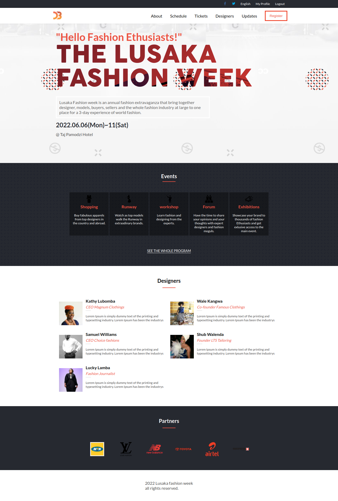
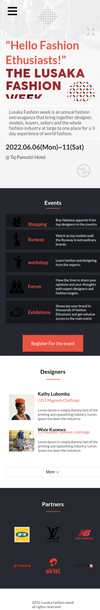

# THE LUSAKA FASHION WEEK

> A website for the annual Lusaka Fashion week. 
>Based on what we have learned in the past for modules i was able to impliment the skills learnt to develop a webstite for 
>The annual Lusaka fashion week.
>the website has the home page and a link to the about page

## Built With

- HTML
- CSS
- Javascript

## Screenshot
* Desktop

* Mobile version

## Live Site URL: 

- https://lyangend.github.io/Capstone-Lusaka-fashion-week/

## Setup

1. Clone the project from github and run "npm start" command and it will run the project localy.

## Author

👤 **David Lyangenda**

- GitHub: [@Lyangenda](https://github.com/LYANGEND)
- Twitter: [@Lyangenda](https://twitter.com/david_lyangenda)
- LinkedIn: [LinkedIn](https://www.linkedin.com/in/david-lyangenda-623087151/)

## 🤝 Contributing

Contributions, issues, and feature requests are welcome!

Feel free to check the [issues page](../../issues/).

## Show your support

Give a ⭐️ if you like this project!

## Acknowledgments

- README template from [Microverse](https://github.com/microverseinc/readme-template)
- Linter setup from [Microverse](https://github.com/microverseinc/linters-config/tree/master/html-css)
- Based on this [beautiful design](<https://www.behance.net/gallery/29845175/CC-Global-Summit-2015>) by [Cindy Shin](<https://www.behance.net/adagio07>). Here is the [Creative Commons License of the design](<https://creativecommons.org/licenses/by-nc/4.0/>). 

## 📝 License

This project is **[MIT](./LICENSE.md)** licensed.
